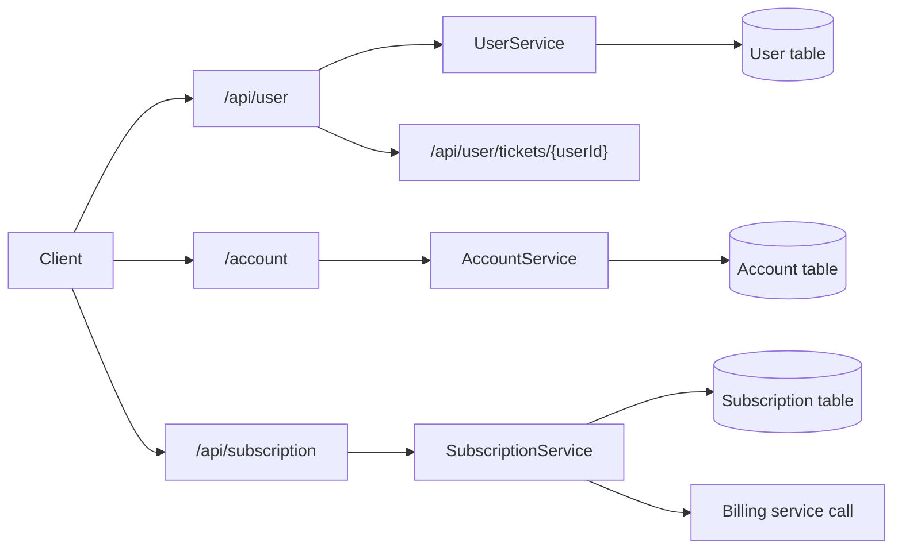

# Telecom Subscription Service

Spring Boot REST API for telecom user, account, and subscription management with MySQL persistence.

## Overview

This project manages telecom customer data in a single Spring Boot service. The application keeps user records, account details, and subscription plans together, while the v2 update adds a ticket lookup route and a subscription flow that hands off billing work to a downstream service call.

The project is useful for understanding CRUD APIs, JPA relationships, DTO mapping, and service-to-service integration through `RestTemplate`.

## Concepts / Features Covered

- Spring Boot REST APIs
- Spring Data JPA entities and repositories
- One-to-one and one-to-many mapping
- DTO-based request handling
- MySQL persistence
- User, account, and subscription CRUD
- User ticket lookup endpoint
- Subscription creation with downstream billing call
- JSON serialization control with `@JsonIgnoreProperties`

## Tech Stack

- Java 17
- Spring Boot 2.7.13
- Spring Web
- Spring Data JPA
- MySQL
- Lombok
- Maven
- RestTemplate

## API Endpoints

### User APIs

- `GET /api/user`
- `GET /api/user/{id}`
- `GET /api/user/name/{name}`
- `GET /api/user/email/{email}`
- `GET /api/user/tickets/{userId}`
- `POST /api/user`
- `PUT /api/user/{id}`
- `DELETE /api/user/{id}`

### Account APIs

- `GET /account`
- `GET /account/{id}`
- `GET /account/userId/{userId}`
- `POST /account`
- `PUT /account/{id}`
- `DELETE /account/{id}`

### Subscription APIs

- `GET /api/subscription`
- `GET /api/subscription/{id}`
- `GET /api/subscription/userId/{userId}`
- `POST /api/subscription`
- `PUT /api/subscription/{id}`
- `DELETE /api/subscription/{id}`

## Example Requests

### Create a user

```bash
curl -X POST http://localhost:8081/api/user \
  -H "Content-Type: application/json" \
  -d '{
    "name": "Asha Patel",
    "email": "asha@example.com",
    "contact": 9876543210,
    "address": "Mumbai"
  }'
```

Expected response:

```json
{
  "message": "User created Successfully"
}
```

### Create an account

```bash
curl -X POST http://localhost:8081/account \
  -H "Content-Type: application/json" \
  -d '{
    "user": { "id": 1 },
    "balance": "2500",
    "details": "Primary billing account"
  }'
```

Expected response:

```json
{
  "message": "Account Created Successfully"
}
```

### Create a subscription

```bash
curl -X POST http://localhost:8081/api/subscription \
  -H "Content-Type: application/json" \
  -d '{
    "userId": 1,
    "price": 499,
    "planName": "Silver Plan",
    "planDetails": "Monthly calling and data pack"
  }'
```

Expected response:

```json
{
  "message": "Subscription Created Successfully"
}
```

### Fetch user tickets

```bash
curl http://localhost:8081/api/user/tickets/1
```

Sample response:

```json
[]
```

## Sample Output

### Get all users

```json
[
  {
    "id": 1,
    "name": "Asha Patel",
    "email": "asha@example.com",
    "contact": 9876543210,
    "address": "Mumbai"
  }
]
```

### Get subscriptions for a user

```json
[
  {
    "id": 1,
    "price": 499,
    "planName": "Silver Plan",
    "planDetails": "Monthly calling and data pack"
  }
]
```

## How to Run

1. Create a MySQL database named `telecom_user_service`.
2. Update the username and password in `src/main/resources/application.yml` if your local MySQL setup is different.
3. Start the application with Maven or from your IDE.
4. Call the endpoints on port `8081`.

Example:

```bash
mvn spring-boot:run
```

## Project Structure

```text
SubscriptionService/
├── src/main/java/Telecom/SubscriptionService/
│   ├── controller/
│   ├── dto/
│   ├── model/
│   ├── repository/
│   ├── service/
│   ├── BillingDtos/
│   ├── SupportDtos/
│   └── SubscriptionServiceApplication.java
├── src/main/resources/application.yml
├── README.md
├── CHANGELOG.md
└── .gitignore
```

## Flow Diagram



## Learning Highlights

- Modeling one-to-one and one-to-many JPA relationships
- Using DTOs to keep request payloads separate from entities
- Building a subscription flow that includes a downstream billing call
- Adding a user-facing ticket lookup route in the same service
- Practicing REST, JPA, and service integration in one project

## Notes

- `application.yml` is kept in the repository for local configuration.
- IDE files and build artifacts are intentionally excluded from version control.
- The user controller also keeps a legacy root mapping for compatibility with older tests.
