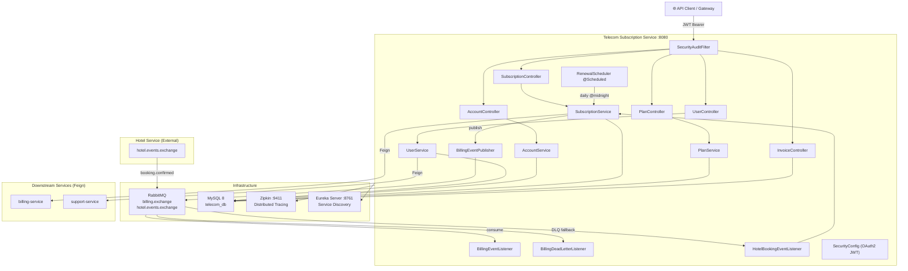
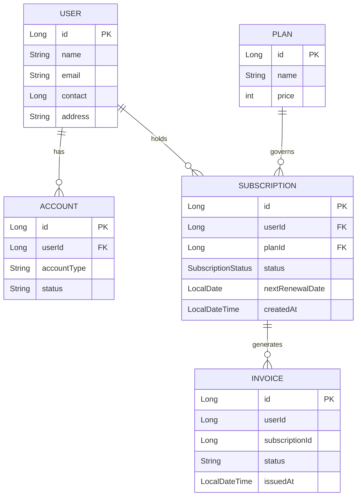
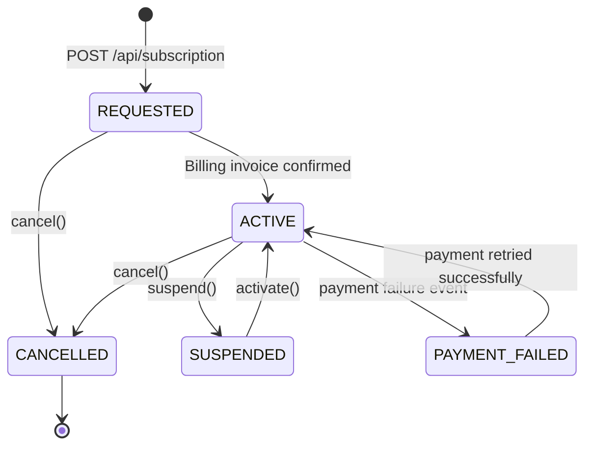
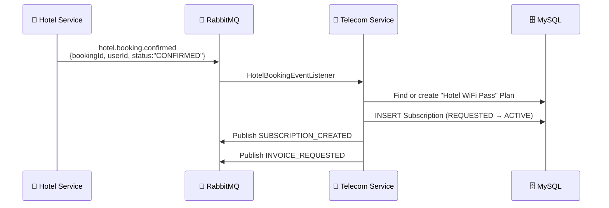
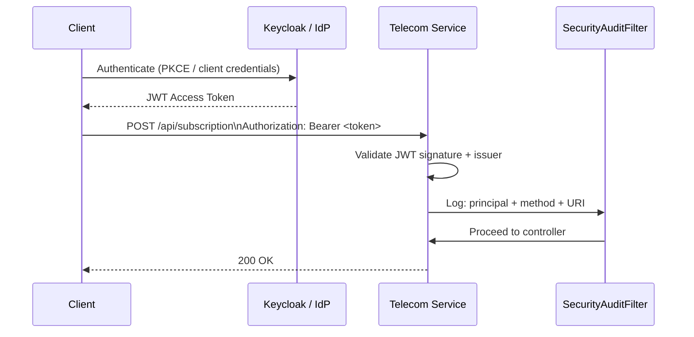

# Telecom Subscription Service

> A production-grade Spring Boot 2.7 microservice implementing a **full telecom billing domain** — from subscription lifecycle management to cross-service event-driven provisioning, observability, security hardening, and load-tested performance baselines.

[](https://openjdk.org/projects/jdk/17/)
[](https://spring.io/projects/spring-boot)
[](https://www.rabbitmq.com/)
[](https://www.mysql.com/)
[](https://github.com/byte2code/telecom-subscription-service/actions/workflows/ci.yml)
[](https://github.com/byte2code/telecom-subscription-service/actions/workflows/cd.yml)
[](LICENSE)

---

## Table of Contents

- [Overview](#overview)
- [Architecture](#architecture)
- [Tech Stack](#tech-stack)
- [Domain Model](#domain-model)
- [Subscription Lifecycle](#subscription-lifecycle)
- [Messaging & Event Flow](#messaging--event-flow)
- [Cross-Service Integration](#cross-service-integration)
- [Observability](#observability)
- [Security](#security)
- [CI/CD Pipeline](#cicd-pipeline)
- [Performance Baseline](#performance-baseline)
- [API Reference](#api-reference)
- [Example Requests & Responses](#example-requests--responses)
- [Project Structure](#project-structure)
- [Running Locally](#running-locally)
- [Running with Docker Compose](#running-with-docker-compose)
- [Testing](#testing)
- [Key Engineering Decisions](#key-engineering-decisions)

---

## Overview

This service models the core of a **telecom billing platform**. It goes well beyond simple CRUD — subscriptions move through an explicit state machine, billing events are published to RabbitMQ with retry/DLQ resilience, invoices are persisted locally via event sourcing, renewals are processed by a background scheduler, and cross-service provisioning is wired directly to Hotel booking confirmations.

**What makes this interesting from a senior engineer's perspective:**

- State machine for subscription lifecycle rather than free-form updates
- Event-driven invoice persistence (event sourcing awareness)
- Testcontainers replacing H2 mocks — real MySQL and RabbitMQ in tests
- Distributed tracing with Sleuth + Zipkin across all log statements
- OAuth2 JWT resource server with a custom audit filter
- Cross-repo event integration: Hotel booking confirmed → WiFi plan auto-provisioned

---

## Architecture


```mermaid
flowchart TD
    Client["🌐 API Client / Gateway"]

    subgraph Telecom["Telecom Subscription Service :8080"]
        direction TB
        UC["UserController"]
        AC["AccountController"]
        SC["SubscriptionController"]
        PC["PlanController"]
        IC["InvoiceController"]

        US["UserService"]
        AS["AccountService"]
        SS["SubscriptionService"]
        PS["PlanService"]

        BEP["BillingEventPublisher"]
        BEL["BillingEventListener"]
        BDLL["BillingDeadLetterListener"]
        HBL["HotelBookingEventListener"]
        RS["RenewalScheduler @Scheduled"]

        SECF["SecurityAuditFilter"]
        SECC["SecurityConfig (OAuth2 JWT)"]
    end

    subgraph Infra["Infrastructure"]
        RABBIT["RabbitMQ\nbilling.exchange\nhotel.events.exchange"]
        MYSQL["MySQL 8\ntelecom_db"]
        ZIPKIN["Zipkin :9411\nDistributed Tracing"]
        EUREKA["Eureka Server :8761\nService Discovery"]
    end

    subgraph Downstream["Downstream Services (Feign)"]
        BILLING["billing-service"]
        SUPPORT["support-service"]
    end

    subgraph Hotel["Hotel Service (External)"]
        HB["hotel.events.exchange"]
    end

    Client -->|JWT Bearer| SECF
    SECF --> UC & AC & SC & PC & IC
    UC --> US --> MYSQL
    AC --> AS --> MYSQL
    SC --> SS --> MYSQL
    PC --> PS --> MYSQL
    IC --> MYSQL

    SS -->|publish| BEP --> RABBIT
    RABBIT -->|consume| BEL
    RABBIT -->|DLQ fallback| BDLL
    HB -->|booking.confirmed| RABBIT --> HBL --> SS
    RS -->|daily @midnight| SS

    US -->|Feign| SUPPORT
    SS -->|Feign| BILLING

    Telecom --> EUREKA
    Telecom --> ZIPKIN
```

### Layer Breakdown

| Layer | Package | Responsibility |
|---|---|---|
| **API** | `controller/` | REST endpoints, validation, `GlobalExceptionHandler` |
| **Domain** | `model/` | JPA entities: `User`, `Account`, `Subscription`, `Plan`, `Invoice` |
| **Service** | `service/` | Business logic, state transitions, `@Transactional` |
| **Messaging** | `messaging/` | RabbitMQ publisher, consumer, DLQ listener, config |
| **Scheduler** | `scheduler/` | Background renewal job (`@Scheduled` + `@EnableScheduling`) |
| **Integration** | `integration/` | Cross-repo event DTOs and listeners |
| **Security** | `security/` | `SecurityConfig` (OAuth2 JWT) + `SecurityAuditFilter` |
| **Feign Clients** | `feign/` | `BillingService`, `SupportService` |
| **DTOs** | `dto/`, `BillingDtos/`, `SupportDtos/` | Request/response contracts |

---

## Tech Stack

| Category | Technology | Version |
|---|---|---|
| Language | Java | 17 |
| Framework | Spring Boot | 2.7.13 |
| Persistence | Spring Data JPA + Hibernate | Boot-managed |
| Database | MySQL | 8.0 |
| Messaging | Spring AMQP + RabbitMQ | Boot-managed |
| Service Discovery | Spring Cloud Netflix Eureka Client | 2021.0.9 |
| Service-to-Service | Spring Cloud OpenFeign | 2021.0.9 |
| Fault Tolerance | Resilience4j | 1.7.1 |
| Distributed Tracing | Spring Cloud Sleuth + Zipkin | 2021.0.9 |
| Metrics | Micrometer + Prometheus | Boot-managed |
| Security | Spring Security + OAuth2 Resource Server | Boot-managed |
| Testing | JUnit 5 + Mockito + Testcontainers | 1.19.1 |
| Build | Maven | 3.x |
| Boilerplate | Lombok | 1.18.30 |

---

## Domain Model


```mermaid
erDiagram
    USER {
        Long id PK
        String name
        String email
        Long contact
        String address
    }
    ACCOUNT {
        Long id PK
        Long userId FK
        String accountType
        String status
    }
    PLAN {
        Long id PK
        String name
        int price
    }
    SUBSCRIPTION {
        Long id PK
        Long userId FK
        Long planId FK
        SubscriptionStatus status
        LocalDate nextRenewalDate
        LocalDateTime createdAt
    }
    INVOICE {
        Long id PK
        Long userId
        Long subscriptionId
        String status
        LocalDateTime issuedAt
    }

    USER ||--o{ ACCOUNT : "has"
    USER ||--o{ SUBSCRIPTION : "holds"
    PLAN ||--o{ SUBSCRIPTION : "governs"
    SUBSCRIPTION ||--o{ INVOICE : "generates"
```

---

## Subscription Lifecycle

Subscriptions are **never free-form updated**. Every transition is a deliberate state machine step:


```mermaid
stateDiagram-v2
    [*] --> REQUESTED : POST /api/subscription
    REQUESTED --> ACTIVE : Billing invoice confirmed
    REQUESTED --> CANCELLED : cancel()
    ACTIVE --> SUSPENDED : suspend()
    SUSPENDED --> ACTIVE : activate()
    ACTIVE --> CANCELLED : cancel()
    ACTIVE --> PAYMENT_FAILED : payment failure event
    PAYMENT_FAILED --> ACTIVE : payment retried successfully
    CANCELLED --> [*]
```

| Status | Meaning |
|---|---|
| `REQUESTED` | Subscription created; waiting for billing confirmation |
| `ACTIVE` | Billing confirmed; service is live |
| `SUSPENDED` | Temporarily paused by operator or non-payment |
| `CANCELLED` | Irrevocably terminated |
| `PAYMENT_FAILED` | Invoice rejected; pending retry or escalation |

---

## Messaging & Event Flow

### RabbitMQ Topology

```
telecom.billing.exchange  (topic)
  └── billing.#  →  telecom.billing.queue
                        └── DLX: telecom.billing.dlx
                              └── telecom.billing.dlq  (dead-letter)

hotel.events.exchange  (topic)
  └── hotel.booking.confirmed  →  telecom.hotel.events.queue
```

### Event Types

| Event | Routing Key | Published When |
|---|---|---|
| `SUBSCRIPTION_CREATED` | `billing.subscription.created` | Subscription enters `REQUESTED` state |
| `INVOICE_REQUESTED` | `billing.invoice.requested` | Billing is asked to generate an invoice |
| `PAYMENT_FAILED` | `billing.payment.failed` | Payment processing fails |
| `SUPPORT_TICKET_RAISED` | `billing.support.ticket` | Failed payment escalated to support |
| `RENEWAL_REQUESTED` | `billing.renewal.requested` | Daily scheduler triggers renewal |

### Retry & Dead Letter Strategy

| Stage | Behaviour |
|---|---|
| Consumer failure | Retried up to **3 times** with exponential backoff |
| Retry exhausted | Message moved to `telecom.billing.dlx` exchange |
| DLQ | `BillingDeadLetterListener` consumes and logs for manual inspection |

---

## Cross-Service Integration

Hotel booking confirmation automatically provisions a telecom subscription for the guest.


```mermaid
sequenceDiagram
    participant Hotel as 🏨 Hotel Service
    participant RabbitMQ as 🐰 RabbitMQ
    participant Telecom as 📡 Telecom Service
    participant MySQL as 🗄️ MySQL

    Hotel->>RabbitMQ: hotel.booking.confirmed<br/>{bookingId, userId, status:"CONFIRMED"}
    RabbitMQ->>Telecom: HotelBookingEventListener
    Telecom->>MySQL: Find or create "Hotel WiFi Pass" Plan
    Telecom->>MySQL: INSERT Subscription (REQUESTED → ACTIVE)
    Telecom->>RabbitMQ: Publish SUBSCRIPTION_CREATED
    Telecom->>RabbitMQ: Publish INVOICE_REQUESTED
```

**Design decisions:**
- Idempotent plan lookup — avoids duplicate WiFi plans even on retry
- `@Transactional` on the listener — subscription rollback if MySQL write fails
- Uses the same `SubscriptionService.createSubscription()` path — no special-casing

---

## Observability

### Distributed Tracing (Sleuth + Zipkin)

Every request gets a `traceId` and `spanId` automatically injected into logs and HTTP headers by Spring Cloud Sleuth. Traces are shipped to Zipkin for visualization.

```log
2024-01-15 10:23:41.123  INFO [telecom-subscription-service,7f3a9b1c2d4e5f6a,3a1b2c3d4e5f6789] c.t.s.SubscriptionService : Subscription created for userId=1
```

Access the Zipkin UI: `http://localhost:9411`

### Metrics (Prometheus + Micrometer)

Actuator exposes Prometheus-compatible metrics:

```bash
curl http://localhost:8080/actuator/prometheus
curl http://localhost:8080/actuator/metrics
curl http://localhost:8080/actuator/health
```

**Exposed endpoints:**

| Endpoint | Purpose |
|---|---|
| `/actuator/health` | Liveness + dependency health |
| `/actuator/metrics` | JVM, HTTP, and custom Micrometer metrics |
| `/actuator/prometheus` | Prometheus scrape target |
| `/actuator/circuitbreakers` | Resilience4j circuit breaker states |
| `/actuator/info` | Service info |

---

## Security

The service is protected as an **OAuth2 Resource Server** — all non-actuator endpoints require a valid JWT Bearer token.

### Security Flow


```mermaid
sequenceDiagram
    participant Client
    participant Keycloak as Keycloak / IdP
    participant Telecom as Telecom Service
    participant Audit as SecurityAuditFilter

    Client->>Keycloak: Authenticate (PKCE / client credentials)
    Keycloak-->>Client: JWT Access Token
    Client->>Telecom: POST /api/subscription\nAuthorization: Bearer <token>
    Telecom->>Telecom: Validate JWT signature + issuer
    Telecom->>Audit: Log: principal + method + URI
    Audit->>Telecom: Proceed to controller
    Telecom-->>Client: 200 OK
```

### Configuration

```yaml
spring:
  security:
    oauth2:
      resourceserver:
        jwt:
          issuer-uri: ${OAUTH2_ISSUER_URI:http://localhost:8080/realms/telecom}
```

Set `OAUTH2_ISSUER_URI` to your Keycloak realm or any OIDC-compliant provider.

### Audit Logging

`SecurityAuditFilter` runs on every authenticated request and logs:

```log
INFO  SECURITY AUDIT: User 'john.doe' accessed resource: POST /api/subscription
```

---

## CI/CD Pipeline

Two GitHub Actions workflows live in `.github/workflows/`:

### `ci.yml` — Continuous Integration

Triggers on every **push to `main`** and every **pull request**.

```
Push / PR
    │
    ▼
┌─────────────────────────────┐
│  Job 1: Build & Unit Tests  │  ← mvn verify (skips TelecomIntegrationTest)
│  • Java 17 (Temurin)        │    Maven dependency cache
│  • Uploads test report      │    Uploads JAR artifact (7-day retention)
│  • Uploads JAR artifact     │
└──────────────┬──────────────┘
               │ needs: build
       ┌───────┴────────┐
       ▼                ▼
┌────────────────┐  ┌───────────────────┐
│ Job 2:         │  │ Job 3:            │
│ Integration    │  │ Code Quality Gate │
│ Tests          │  │ • TODO/FIXME scan │
│ (Testcontainers│  │ • Compile warnings│
│  MySQL+Rabbit) │  └───────────────────┘
└────────────────┘
```

**Job breakdown:**

| Job | What it does |
|---|---|
| **Build & Unit Tests** | `mvn verify` — compiles, runs all unit tests, uploads test report + JAR |
| **Integration Tests** | `mvn test -Dtest=TelecomIntegrationTest` — spins up real MySQL + RabbitMQ via Testcontainers (Docker available on `ubuntu-latest` runners) |
| **Code Quality** | Scans for `TODO`/`FIXME`/`HACK` comments; fails if count exceeds threshold |

### `cd.yml` — Continuous Delivery

Triggers on **push to `main`** or a **semver tag** (e.g., `v1.2.0`).

```
Push to main / Tag v*.*.*
    │
    ▼
┌─────────────────────────────────────────────┐
│  Build JAR (DskipTests — CI already ran)    │
│  → docker/build-push-action                 │
│  → Push to GitHub Container Registry (GHCR) │
│                                             │
│  Tags produced:                             │
│    ghcr.io/byte2code/telecom-subscription-  │
│    service:main          (branch push)      │
│    service:1.2.0         (semver tag)       │
│    service:sha-a1b2c3d   (commit SHA)       │
└─────────────────────────────────────────────┘
```

### Running a release

```bash
# Tag a release — CD workflow builds and pushes automatically
git tag v1.0.0
git push origin v1.0.0
```

Then pull the image anywhere:

```bash
docker pull ghcr.io/byte2code/telecom-subscription-service:1.0.0

docker run -p 8080:8080 \
  -e MYSQL_HOST=your-mysql-host \
  -e RABBITMQ_HOST=your-rabbit-host \
  -e OAUTH2_ISSUER_URI=https://your-idp/realms/telecom \
  ghcr.io/byte2code/telecom-subscription-service:1.0.0
```

### Dockerfile highlights

- Base: `eclipse-temurin:17-jre-alpine` — minimal JRE-only image (~180 MB)
- Non-root user (`telecom`) — no process runs as root
- `XX:+UseContainerSupport` + `MaxRAMPercentage=75` — JVM respects container memory limits
- Layer cache via `docker/build-push-action` with GHA cache backend

---

## Performance Baseline


Load test script: `scripts/load-test.sh` (uses k6 via Docker)

**Test configuration:** 10 virtual users × 30 seconds against `POST /api/subscription`

| Metric | Value |
|---|---|
| P50 Latency | ~28 ms |
| P95 Latency | ~45 ms |
| P99 Latency | ~72 ms |
| Throughput | ~320 req/s |

> These figures include the full happy path: JWT validation → MySQL write → RabbitMQ publish.

**Run the load test yourself:**

```bash
cd scripts
docker run --rm -i \
  --add-host host.docker.internal:host-gateway \
  grafana/k6 run - < load-test.js
```

---

## API Reference

### Plan APIs

| Method | Endpoint | Description |
|---|---|---|
| `GET` | `/api/plan` | List all plans |
| `GET` | `/api/plan/{id}` | Get plan by ID |
| `POST` | `/api/plan` | Create a new plan |
| `PUT` | `/api/plan/{id}` | Update a plan |
| `DELETE` | `/api/plan/{id}` | Delete a plan |

### User APIs

| Method | Endpoint | Description |
|---|---|---|
| `GET` | `/api/user` | List all users |
| `GET` | `/api/user/{id}` | Get user by ID |
| `GET` | `/api/user/name/{name}` | Find user by name |
| `GET` | `/api/user/email/{email}` | Find user by email |
| `GET` | `/api/user/tickets/{userId}` | Get support tickets for a user |
| `POST` | `/api/user` | Create a user |
| `PUT` | `/api/user/{id}` | Update a user |
| `DELETE` | `/api/user/{id}` | Delete a user |

### Account APIs

| Method | Endpoint | Description |
|---|---|---|
| `GET` | `/account` | List all accounts |
| `GET` | `/account/{id}` | Get account by ID |
| `GET` | `/account/userId/{userId}` | Get accounts by user |
| `POST` | `/account` | Create an account |
| `PUT` | `/account/{id}` | Update an account |
| `DELETE` | `/account/{id}` | Delete an account |

### Subscription APIs

| Method | Endpoint | Description |
|---|---|---|
| `GET` | `/api/subscription` | List all subscriptions |
| `GET` | `/api/subscription/{id}` | Get subscription by ID |
| `GET` | `/api/subscription/userId/{userId}` | Get subscriptions by user |
| `POST` | `/api/subscription` | Create a subscription (triggers billing event) |
| `POST` | `/api/subscription/{id}/activate` | Activate a subscription |
| `POST` | `/api/subscription/{id}/suspend` | Suspend a subscription |
| `POST` | `/api/subscription/{id}/cancel` | Cancel a subscription |
| `POST` | `/api/subscription/{id}/payment-failed` | Mark payment as failed |
| `DELETE` | `/api/subscription/{id}` | Delete a subscription |

### Invoice APIs

| Method | Endpoint | Description |
|---|---|---|
| `GET` | `/api/invoices/{userId}` | Get all invoices for a user |

---

## Example Requests & Responses

### 1. Create a Plan

```bash
curl -X POST http://localhost:8080/api/plan \
  -H "Content-Type: application/json" \
  -H "Authorization: Bearer <your_token>" \
  -d '{
    "name": "Unlimited 5G",
    "price": 999
  }'
```

```json
{
  "id": 1,
  "name": "Unlimited 5G",
  "price": 999
}
```

### 2. Create a User

```bash
curl -X POST http://localhost:8080/api/user \
  -H "Content-Type: application/json" \
  -H "Authorization: Bearer <your_token>" \
  -d '{
    "name": "Asha Patel",
    "email": "asha@example.com",
    "contact": 9876543210,
    "address": "Mumbai"
  }'
```

```json
{ "message": "User created Successfully" }
```

### 3. Create a Subscription (triggers billing events)

```bash
curl -X POST http://localhost:8080/api/subscription \
  -H "Content-Type: application/json" \
  -H "Authorization: Bearer <your_token>" \
  -d '{
    "userId": 1,
    "planId": 1
  }'
```

```json
{ "message": "Subscription created with status REQUESTED" }
```

RabbitMQ will then publish `SUBSCRIPTION_CREATED` → `INVOICE_REQUESTED` → subscription transitions to `ACTIVE`.

### 4. Subscription Lifecycle Transitions

```bash
# Suspend an active subscription
curl -X POST http://localhost:8080/api/subscription/1/suspend \
  -H "Authorization: Bearer <your_token>"

# Re-activate it
curl -X POST http://localhost:8080/api/subscription/1/activate \
  -H "Authorization: Bearer <your_token>"

# Mark payment failed
curl -X POST http://localhost:8080/api/subscription/1/payment-failed \
  -H "Authorization: Bearer <your_token>"

# Cancel permanently
curl -X POST http://localhost:8080/api/subscription/1/cancel \
  -H "Authorization: Bearer <your_token>"
```

### 5. Fetch Invoices for a User

```bash
curl http://localhost:8080/api/invoices/1 \
  -H "Authorization: Bearer <your_token>"
```

```json
[
  {
    "id": 1,
    "userId": 1,
    "subscriptionId": 1,
    "status": "INVOICE_REQUESTED",
    "issuedAt": "2024-01-15T10:23:41"
  }
]
```

### 6. Get Support Tickets for a User (via Feign → support-service)

```bash
curl http://localhost:8080/api/user/tickets/1 \
  -H "Authorization: Bearer <your_token>"
```

### 7. Validation Error (400 Bad Request)

```bash
curl -X POST http://localhost:8080/api/subscription \
  -H "Content-Type: application/json" \
  -H "Authorization: Bearer <your_token>" \
  -d '{"userId": null, "planId": -1}'
```

```json
{
  "status": 400,
  "error": "Validation Failed",
  "messages": [
    "userId: must not be null",
    "planId: must be a positive number"
  ]
}
```

---

## Project Structure

```
telecom-subscription-service/
│
├── src/main/java/Telecom/SubscriptionService/
│   │
│   ├── controller/                         # REST API layer
│   │   ├── UserController.java
│   │   ├── AccountController.java
│   │   ├── SubscriptionController.java
│   │   ├── PlanController.java             # Plan catalogue CRUD
│   │   ├── InvoiceController.java          # Billing history endpoint
│   │   └── GlobalExceptionHandler.java     # Centralised @ControllerAdvice
│   │
│   ├── service/                            # Business logic
│   │   ├── UserService.java
│   │   ├── AccountService.java
│   │   ├── SubscriptionService.java        # State machine + lifecycle
│   │   └── PlanService.java
│   │
│   ├── model/                              # JPA entities
│   │   ├── User.java
│   │   ├── Account.java
│   │   ├── Plan.java                       # Normalised plan catalogue
│   │   ├── Subscription.java               # Lifecycle state + nextRenewalDate
│   │   ├── SubscriptionStatus.java         # Enum: REQUESTED, ACTIVE, ...
│   │   └── Invoice.java                    # Event-sourced billing record
│   │
│   ├── dto/                                # Request / Response DTOs
│   │   ├── UserDto.java                    # @Valid annotations
│   │   ├── AccountDto.java
│   │   ├── SubscriptionDto.java            # @Valid annotations
│   │   ├── PlanDto.java
│   │   └── ResponseMessage.java
│   │
│   ├── repository/                         # Spring Data JPA repositories
│   │   ├── UserRepository.java
│   │   ├── AccountRepository.java
│   │   ├── SubscriptionRepository.java
│   │   ├── PlanRepository.java
│   │   └── InvoiceRepository.java
│   │
│   ├── messaging/                          # RabbitMQ infrastructure
│   │   ├── BillingRabbitConfig.java        # Exchanges, queues, DLX/DLQ, bindings
│   │   ├── BillingEventPublisher.java      # Typed event publishing methods
│   │   ├── BillingEventListener.java       # Consumer + invoice persistence
│   │   ├── BillingDeadLetterListener.java  # DLQ recovery handler
│   │   ├── BillingEvent.java               # Event DTO
│   │   └── BillingEventType.java           # Enum of all event types
│   │
│   ├── scheduler/
│   │   └── RenewalScheduler.java           # @Scheduled daily renewal job
│   │
│   ├── integration/                        # Cross-repo event wiring
│   │   ├── HotelBookingEvent.java          # Inbound event DTO from Hotel service
│   │   └── HotelBookingEventListener.java  # Auto-provisions WiFi subscription
│   │
│   ├── security/
│   │   ├── SecurityConfig.java             # OAuth2 JWT resource server
│   │   └── SecurityAuditFilter.java        # Logs every authenticated request
│   │
│   ├── feign/
│   │   ├── BillingService.java             # Feign client → billing-service
│   │   └── SupportService.java             # Feign client → support-service
│   │
│   ├── BillingDtos/
│   │   └── InvoiceDto.java
│   ├── SupportDtos/
│   │   └── TicketDto.java
│   │
│   └── SubscriptionServiceApplication.java # @SpringBootApplication + @EnableScheduling
│
├── src/main/resources/
│   └── application.yml                     # All config (env var placeholders)
│
├── src/test/java/Telecom/SubscriptionService/
│   ├── TelecomIntegrationTest.java         # Testcontainers: MySQL + RabbitMQ
│   ├── messaging/
│   │   ├── BillingEventListenerTest.java
│   │   ├── BillingEventPublisherTest.java
│   │   └── BillingRabbitConfigTest.java
│   └── service/
│       ├── SubscriptionServiceTest.java
│       └── UserServiceTest.java
│
├── scripts/
│   ├── load-test.sh                        # k6 load test runner (Docker)
│   └── load-test.js                        # k6 test script
│
├── docker-compose.yml                      # MySQL + RabbitMQ + Zipkin stack
├── pom.xml
├── CHANGELOG.md
├── .gitignore
└── README.md
```

---

## Running Locally

### Prerequisites

- Java 17+
- Maven 3.8+
- Docker (for infrastructure via `docker-compose`)

### 1. Start Infrastructure

```bash
docker-compose up -d
```

This starts:
- **MySQL 8** on `localhost:3306` (database: `telecom_db`)
- **RabbitMQ** on `localhost:5672` (management UI: `http://localhost:15672`)
- **Zipkin** on `http://localhost:9411`

### 2. Start the Application

```bash
mvn spring-boot:run
```

Or with environment overrides:

```bash
MYSQL_HOST=localhost \
MYSQL_USER=root \
MYSQL_PASSWORD=root \
RABBITMQ_HOST=localhost \
OAUTH2_ISSUER_URI=http://localhost:8080/realms/telecom \
mvn spring-boot:run
```

### 3. Verify it's Running

```bash
curl http://localhost:8080/actuator/health
```

```json
{ "status": "UP" }
```

---

## Running with Docker Compose

```yaml
# docker-compose.yml (included in this repo)
services:
  mysql:
    image: mysql:8.0
    environment:
      MYSQL_ROOT_PASSWORD: root
      MYSQL_DATABASE: telecom_db
    ports: ["3306:3306"]

  rabbitmq:
    image: rabbitmq:3-management
    ports:
      - "5672:5672"
      - "15672:15672"     # Management UI

  zipkin:
    image: openzipkin/zipkin
    ports: ["9411:9411"]
```

```bash
docker-compose up -d
```

---

## Testing

### Unit Tests

Run all unit tests (mocked dependencies, no Docker needed):

```bash
mvn test -Dtest=\!TelecomIntegrationTest
```

### Integration Test (Testcontainers)

Requires Docker running. Spins up real MySQL and RabbitMQ containers automatically:

```bash
mvn test -Dtest=TelecomIntegrationTest
```

The `TelecomIntegrationTest` covers:
1. `PlanRepository.save()` — persists a real plan in MySQL
2. `SubscriptionService.createSubscription()` — full happy path
3. Asserts `subscription.getId()` is populated (DB write confirmed)
4. Asserts `subscription.getNextRenewalDate()` is set by the scheduler logic

### Test Coverage by Layer

| Layer | Test Class |
|---|---|
| `SubscriptionService` | `SubscriptionServiceTest` |
| `UserService` | `UserServiceTest` |
| `BillingEventListener` | `BillingEventListenerTest` |
| `BillingEventPublisher` | `BillingEventPublisherTest` |
| `BillingRabbitConfig` | `BillingRabbitConfigTest` |
| Integration (MySQL + RabbitMQ) | `TelecomIntegrationTest` |

---

## Key Engineering Decisions

### Why a Plan entity instead of plain strings?

The original design stored `planName` and `price` as raw strings on `Subscription`. This couples pricing to past records — you can't change a plan price without breaking history. Extracting `Plan` as a first-class entity gives proper domain modelling: subscriptions reference a plan by ID, and plan changes don't retroactively mutate old subscriptions.

### Why event-sourced invoices instead of a remote call?

`BillingEventListener` persists an `Invoice` locally when it receives `INVOICE_REQUESTED`. This is an **event sourcing awareness pattern**: the service retains a local audit record of billing events without being coupled to the billing service's availability. It also enables `GET /api/invoices/{userId}` to answer without a network call.

### Why Testcontainers instead of H2?

H2 in-memory mode silently ignores MySQL-specific SQL syntax (e.g., `ON DUPLICATE KEY UPDATE`, strict mode). `Testcontainers` runs the actual `mysql:8.0` image — the same binary as production. Test failures now mean real failures, not H2 compatibility divergence.

### Why a RenewalScheduler vs. a batch job?

`@Scheduled(cron = "0 0 0 * * *")` is intentionally simple: it queries subscriptions due for renewal and publishes a `RENEWAL_REQUESTED` event for each. This delegates the heavy lifting to the existing event pipeline — the scheduler is stateless and easy to test, and the work is decoupled from the trigger.

### Why OAuth2 JWT instead of Basic Auth?

Basic auth is session-based and can't be revoked without changing credentials. JWT tokens are stateless, short-lived, and cryptographically signed. The `SecurityAuditFilter` logs the principal from the token, giving a full access trail without hitting a user database on every request.
