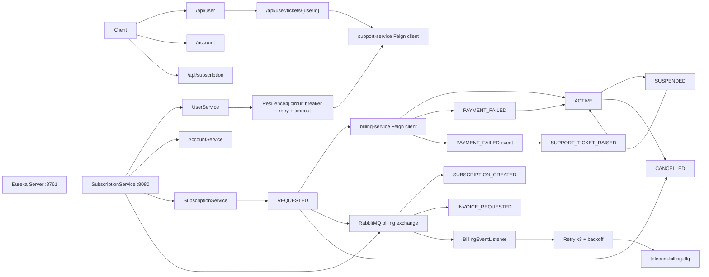

# Telecom Subscription Service

Spring Boot REST API for telecom user, account, and subscription management with Eureka registration, Resilience4j fault tolerance, RabbitMQ billing events, retry/DLQ handling, Feign-based downstream calls, and an explicit subscription lifecycle.

## Overview

This project manages telecom customer data in a single Spring Boot service. The current version keeps the existing user and account flows, but turns subscriptions into a lifecycle-driven workflow. Subscription creation now starts in `REQUESTED`, billing success promotes the subscription to `ACTIVE`, and the service exposes explicit transitions for suspend, cancel, and payment failure handling.

The project is useful for understanding lifecycle-based APIs, JPA relationships, DTO mapping, service discovery, declarative service-to-service communication, async billing events, retry/DLQ patterns, and resilience patterns for downstream failures.

## Architecture

| Layer | Responsibility |
| --- | --- |
| API layer | Exposes user, account, and subscription endpoints and returns simple response messages |
| Domain layer | Keeps the subscription lifecycle explicit with `REQUESTED`, `ACTIVE`, `SUSPENDED`, `CANCELLED`, and `PAYMENT_FAILED` states |
| Resilience layer | Uses Resilience4j to protect support-ticket lookup with circuit breaker, retry, timeout, and fallback handling |
| Messaging layer | Publishes RabbitMQ billing events, retries failed consumers, and moves poisoned messages to a dead-letter queue |
| Integration layer | Talks to `billing-service`, `support-service`, Eureka, and MySQL |

## Concepts / Features Covered

- Spring Boot REST APIs
- Spring Data JPA entities and repositories
- One-to-one and one-to-many mapping
- DTO-based request handling
- User, account, and subscription CRUD
- Eureka client registration
- Resilience4j circuit breaker, retry, timeout, and fallback support
- RabbitMQ-driven billing events with retry and DLQ recovery
- OpenFeign clients for billing and support calls
- Subscription lifecycle states: `REQUESTED`, `ACTIVE`, `SUSPENDED`, `CANCELLED`, `PAYMENT_FAILED`
- Subscription creation with downstream invoice creation
- Billing-aware activation and payment failure handling
- Support ticket escalation through events
- Ticket retrieval from support-service
- JSON serialization control with `@JsonIgnoreProperties`

## Tech Stack

- Java 17
- Spring Boot 2.7.13
- Spring Web
- Spring Data JPA
- Spring Cloud Netflix Eureka Client
- Spring AOP
- Resilience4j Spring Boot 2
- Spring AMQP
- Spring Retry
- Spring Cloud OpenFeign
- RabbitMQ
- MySQL
- Lombok
- Maven

## API Endpoints

### User APIs

- `GET /api/user`
- `GET /api/user/{id}`
- `GET /api/user/name/{name}`
- `GET /api/user/email/{email}`
- `GET /api/user/tickets/{userId}`
- `POST /api/user`
- `PUT /api/user/{id}`
- `DELETE /api/user/{id}`

### Account APIs

- `GET /account`
- `GET /account/{id}`
- `GET /account/userId/{userId}`
- `POST /account`
- `PUT /account/{id}`
- `DELETE /account/{id}`

### Subscription APIs

- `GET /api/subscription`
- `GET /api/subscription/{id}`
- `GET /api/subscription/userId/{userId}`
- `POST /api/subscription`
- `POST /api/subscription/{id}/activate`
- `POST /api/subscription/{id}/suspend`
- `POST /api/subscription/{id}/cancel`
- `POST /api/subscription/{id}/payment-failed`
- `DELETE /api/subscription/{id}`

## Billing Event Flow

| Event | When It Happens |
| --- | --- |
| `SUBSCRIPTION_CREATED` | A subscription is saved in `REQUESTED` state |
| `INVOICE_REQUESTED` | The service asks billing to generate an invoice |
| `PAYMENT_FAILED` | Billing rejects the invoice request or payment processing fails |
| `SUPPORT_TICKET_RAISED` | A failed payment is escalated for support follow-up |

## Retry and Dead Letter

| Step | Behavior |
| --- | --- |
| Retry | Billing events are retried up to 3 times with exponential backoff |
| Dead Letter | Messages that still fail are republished to `telecom.billing.dlx` and consumed from `telecom.billing.dlq` |

## Example Requests

### Create a user

```bash
curl -X POST http://localhost:8080/api/user \
  -H "Content-Type: application/json" \
  -d '{
    "name": "Asha Patel",
    "email": "asha@example.com",
    "contact": 9876543210,
    "address": "Mumbai"
  }'
```

Expected response:

```json
{
  "message": "User created Successfully"
}
```

### Create a subscription

```bash
curl -X POST http://localhost:8080/api/subscription \
  -H "Content-Type: application/json" \
  -d '{
    "userId": 1,
    "price": 499,
    "planName": "Silver Plan",
    "planDetails": "Monthly calling and data pack"
  }'
```

Expected response:

```json
{
  "message": "Subscription created with status ACTIVE"
}
```

### Move a subscription through its lifecycle

```bash
curl -X POST http://localhost:8080/api/subscription/1/suspend
curl -X POST http://localhost:8080/api/subscription/1/activate
curl -X POST http://localhost:8080/api/subscription/1/cancel
```

### Fetch user tickets

```bash
curl http://localhost:8080/api/user/tickets/1
```

Sample response:

```json
[]
```

## Sample Output

### Get all users

```json
[
  {
    "id": 1,
    "name": "Asha Patel",
    "email": "asha@example.com",
    "contact": 9876543210,
    "address": "Mumbai"
  }
]
```

### Get subscriptions for a user

```json
[
  {
    "id": 1,
    "price": 499,
    "planName": "Silver Plan",
    "planDetails": "Monthly calling and data pack"
  }
]
```

## How to Run

1. Start your Eureka server on `http://localhost:8761`.
2. Start RabbitMQ on `localhost:5672` if you want the billing events and listener to run.
3. Make sure the downstream billing and support services are available if you want the Feign calls to succeed.
4. Provide MySQL datasource settings in your local environment or profile, since this snapshot keeps discovery, resilience, and messaging settings in `application.yml`.
5. Start the application with Maven or from your IDE.
6. Call the endpoints on port `8080`.

Example:

```bash
mvn spring-boot:run
```

## Project Structure

```text
SubscriptionService/
├── src/main/java/Telecom/SubscriptionService/
│   ├── controller/
│   ├── dto/
│   ├── feign/
│   ├── model/
│   ├── repository/
│   ├── service/
│   ├── BillingDtos/
│   ├── SupportDtos/
│   └── SubscriptionServiceApplication.java
├── src/main/resources/application.yml
├── README.md
├── CHANGELOG.md
└── .gitignore
```

## Flow Diagram


```mermaid
flowchart LR
    Client[Client] --> UserAPI["/api/user"]
    Client --> AccountAPI["/account"]
    Client --> SubAPI["/api/subscription"]

    Eureka["Eureka Server :8761"] --- App["SubscriptionService :8080"]
    App --> UserService["UserService"]
    App --> AccountService["AccountService"]
    App --> SubService["SubscriptionService"]
    App --> Rabbit["RabbitMQ billing exchange"]

    SubService --> Requested["REQUESTED"]
    Requested --> BillingClient["billing-service Feign client"]
    Requested --> Rabbit
    Rabbit --> Created["SUBSCRIPTION_CREATED"]
    Rabbit --> Invoice["INVOICE_REQUESTED"]
    Rabbit --> Listener["BillingEventListener"]
    Listener --> Retry["Retry x3 + backoff"]
    Retry --> DLQ["telecom.billing.dlq"]
    BillingClient --> Active["ACTIVE"]
    BillingClient --> PaymentFailed["PAYMENT_FAILED"]
    BillingClient --> FailedEvent["PAYMENT_FAILED event"]
    FailedEvent --> SupportEvent["SUPPORT_TICKET_RAISED"]
    Active --> Suspended["SUSPENDED"]
    Suspended --> Active
    Active --> Cancelled["CANCELLED"]
    Requested --> Cancelled
    PaymentFailed --> Active
    UserService --> Resilience["Resilience4j circuit breaker + retry + timeout"]
    Resilience --> SupportClient["support-service Feign client"]
    UserAPI --> Tickets["/api/user/tickets/{userId}"]
    Tickets --> SupportClient
```

## Learning Highlights

- Using Eureka client registration in a Spring Boot app
- Using Feign clients for downstream billing and support calls
- Adding separate downstream calls for billing and support
- Turning subscriptions into a lifecycle-driven workflow instead of plain CRUD
- Managing billing-aware state transitions for subscriptions
- Replacing Hystrix with Resilience4j circuit breaker, retry, timeout, and fallback handling
- Publishing RabbitMQ billing events with retry and dead-letter handling
- Managing JPA relationships while exposing DTO-friendly REST APIs

## Notes

- The application keeps `application.yml` focused on discovery and resilience settings.
- Local datasource settings are expected to be supplied outside this file.
- IDE files and build artifacts are intentionally excluded from version control.
